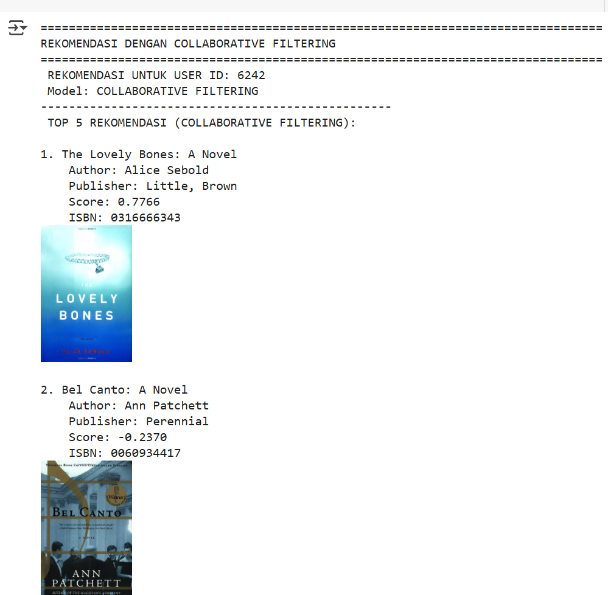
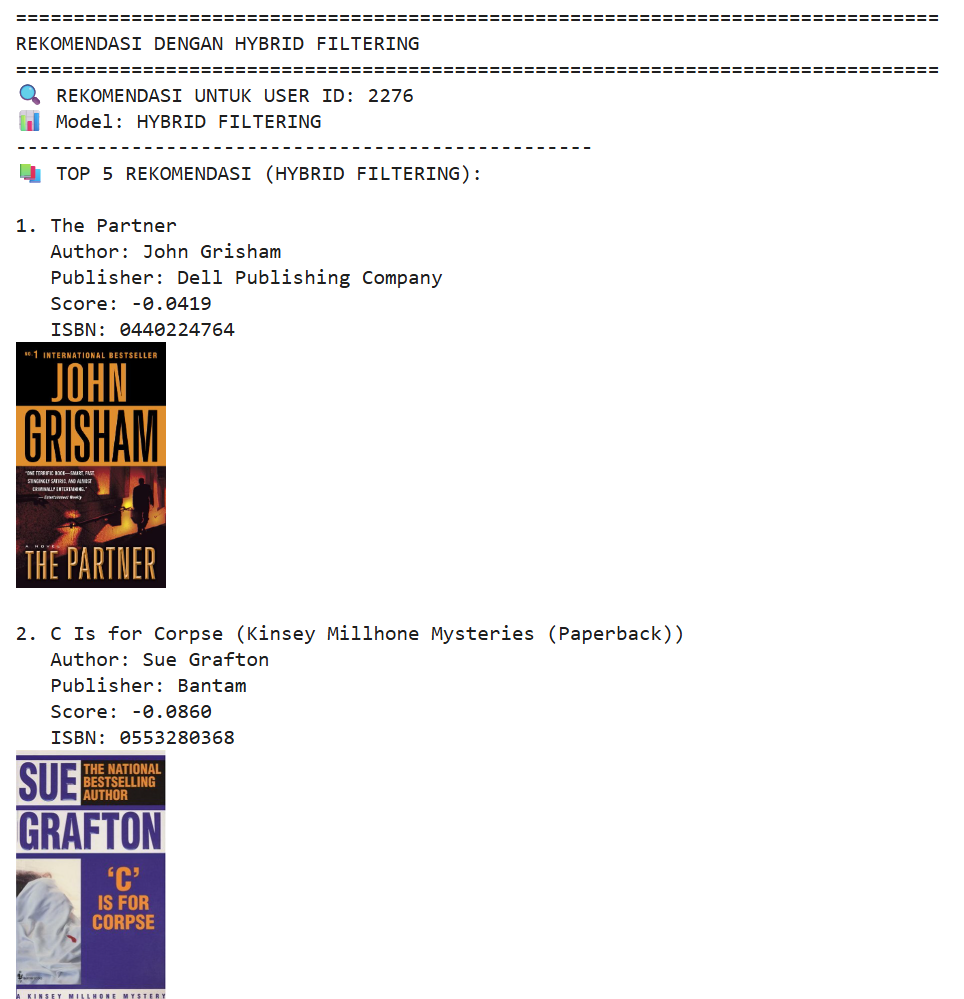
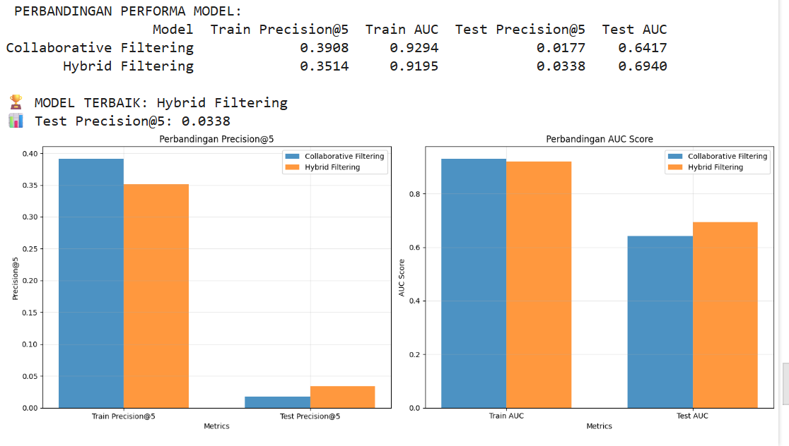

# Laporan Proyek Machine Learning - Haldies Gerhardien Pasya

## Project Overview (Ulasan Proyek)

Sistem rekomendasi buku memainkan peran krusial dalam membantu pembaca menemukan literatur yang sesuai dengan minat dan preferensi mereka, khususnya di era digital yang dibanjiri informasi. Tanpa sistem rekomendasi yang efektif, pengguna sering kali merasa kewalahan dengan banyaknya pilihan buku yang tersedia. Sistem ini tidak hanya meningkatkan pengalaman pengguna tetapi juga berkontribusi pada peningkatan penjualan dan kepuasan pelanggan bagi penyedia platform buku.

Di era digital saat ini, volume informasi yang tersedia telah mencapai tingkat yang belum pernah terjadi sebelumnya. Fenomena ini, yang dikenal sebagai overload informasi, menimbulkan tantangan signifikan bagi individu untuk mengidentifikasi dan mengakses konten yang benar-benar relevan di tengah lautan data yang membanjiri [1], [2], [3]. Sistem rekomendasi menjadi sangat penting dalam mengatasi masalah ini dengan memberikan saran yang relevan dan personal kepada pengguna [4]. Tanpa adanya sistem semacam ini, pembaca, misalnya, akan menghadapi kesulitan besar dalam menemukan buku yang mereka cari di antara koleksi yang sangat luas [5].

Peran fundamental sistem rekomendasi dalam navigasi informasi modern sangatlah krusial. Digitalisasi telah menyebabkan ledakan informasi yang masif, mencakup berbagai produk, layanan, dan bentuk konten [6], [7]. Keterbatasan kognitif manusia dalam memproses volume data yang begitu besar berarti bahwa tanpa bantuan, pengguna akan dengan mudah kewalahan dan kesulitan menemukan apa yang relevan bagi mereka, yang pada akhirnya mengarah pada information overload [2], [3], [8]. Dalam menghadapi tantangan ini, sistem rekomendasi muncul sebagai pemandu cerdas atau filter yang secara proaktif mengkurasi konten dan produk untuk mencocokkan preferensi individu [9]. Hal ini menunjukkan bahwa sistem rekomendasi bukan sekadar fitur tambahan, tetapi infrastruktur fundamental yang memungkinkan pengalaman digital yang fungsional dan efisien, mengubah lautan informasi yang membanjiri menjadi pengalaman yang personal dan mudah dikelola, menandai pergeseran dari pencarian aktif oleh pengguna menjadi penemuan pasif yang dibantu oleh kecerdasan buatan.

Dalam konteks big data, sistem rekomendasi merupakan alat yang sangat penting untuk berbagi pengetahuan dan membantu pengguna menemukan konten yang relevan secara efektif [10]. Mereka memungkinkan personalisasi dengan menganalisis data pengguna dan menghasilkan saran yang sangat mungkin diminati oleh individu tersebut [11].

## Business Understanding

### Problem Statements (Pernyataan Masalah)

1. **Kelebihan Informasi (Information Overload) bagi Pengguna**: Dengan jutaan judul buku yang tersedia di platform digital, pengguna seringkali merasa kewalahan dan kesulitan dalam menemukan buku yang relevan dengan minat mereka. Kurangnya alat yang efektif untuk menyaring dan mempersonalisasi pilihan menyebabkan paradoks pilihan, di mana banyaknya opsi justru menghambat pengambilan keputusan dan mengurangi kepuasan pengguna [2], [3], [8].

2.  **Rekomendasi yang Kurang Relevan**: Sistem rekomendasi yang ada saat ini seringkali memberikan saran yang kurang relevan, terutama untuk pengguna baru (*cold start*) yang belum memiliki banyak data interaksi atau rating buku, sehingga mengurangi efektivitas sistem.
3.  **Potensi Kerugian Penjualan bagi Penyedia Platform**: Platform buku digital menghadapi tantangan dalam menjaga pengguna tetap terlibat dan mendorong mereka untuk menjelajahi lebih banyak konten. Jika pengguna kesulitan menemukan buku yang menarik, tingkat retensi dan konversi (misalnya, pembelian atau waktu yang dihabiskan di platform) dapat menurun, yang berdampak langsung pada pendapatan dan pertumbuhan bisnis.

### Goals (Tujuan)

1.  **Mengurangi Kelebihan Informasi dan Meningkatkan Efisiensi Pencarian**: Mengembangkan sistem yang mampu menyaring dan mempersonalisasi rekomendasi buku, sehingga pengguna dapat dengan cepat dan efisien menemukan judul yang relevan dengan preferensi mereka, mengurangi waktu dan upaya yang dibutuhkan untuk pencarian [4], [9].
2.  **Meningkatkan Penemuan Buku Baru dan Keragaman Bacaan:** Merancang algoritma yang tidak hanya merekomendasikan buku berdasarkan preferensi eksplisit, tetapi juga memfasilitasi penemuan judul-judul yang tidak terduga (serendipitous) dan relevan, memperluas cakrawala bacaan pengguna dan mendorong eksplorasi genre atau penulis baru.
3.  **Meningkatkan Penjualan dan Loyalitas Pengguna**: Menyediakan rekomendasi buku yang dipersonalisasi yang relevan bagi setiap pengguna, yang pada akhirnya akan meningkatkan pengalaman pembaca, mempermudah keputusan pembelian, dan mendorong loyalitas.

### Solution Approach (Pendekatan Solusi)

Untuk membangun sistem rekomendasi buku yang akurat dan relevan, kami mengadopsi dua pendekatan utama: Collaborative Filtering dan Hybrid Filtering (gabungan antara Collaborative dan Content-Based). Kedua pendekatan ini memungkinkan sistem untuk memanfaatkan baik data interaksi pengguna dengan item, maupun metadata (fitur) dari pengguna dan item itu sendiri, guna menghasilkan rekomendasi yang lebih kaya dan adaptif.

1.  **Collaborative Filtering Filtering (Penyaringan Berbasis Konten)**:

      * **Deskripsi**: Sistem merekomendasikan item berdasarkan perilaku atau preferensi pengguna lain yang serupa. Dengan menganalisis pola interaksi seperti rating atau lain nya, item dapat menyimpulkan bahwa pengguna yang menunjukkan minat serupa di masa lalu kemungkinan akan menyukai item yang sama.
      * **Mekanisme**: Jika pengguna menyukai buku dengan genre "Fantasi" dan penulis "J.K. Rowling", sistem akan mencari buku lain yang memiliki genre atau penulis yang serupa.
      * **Kelebihan**:
          * Tidak memerlukan data interaksi dari pengguna lain, sehingga efektif untuk masalah *cold start* pada pengguna baru (selama ada data profil pengguna atau interaksi awal dengan beberapa item).
          * Mampu merekomendasikan item yang baru atau jarang diinteraksikan oleh pengguna lain.
          * Rekomendasi mudah dijelaskan (misalnya, "Anda menyukai buku ini karena genre-nya sama").
      * **Kekurangan**:
          * Keterbatasan pada fitur item: Hanya bisa merekomendasikan item yang serupa dengan yang sudah ada dalam profil pengguna. Tidak dapat merekomendasikan item di luar "lingkaran" preferensi yang sudah dikenal (kurang eksploratif).
          * Membutuhkan deskripsi item yang kaya dan terstruktur.
          * Masalah *cold start* pada item baru (jika item baru belum memiliki deskripsi konten yang memadai).

2.  **Hybrid Collaborative Filtering dan Content-based**:

      * **Deskripsi**: Pendekatan ini merekomendasikan item kepada pengguna berdasarkan preferensi atau perilaku pengguna lain yang serupa, atau berdasarkan kesamaan antar item yang dinilai oleh banyak pengguna. Ada dua sub-pendekatan utama:
          * **User-Based Collaborative Filtering**: Mencari pengguna dengan selera serupa dan merekomendasikan item yang disukai oleh "tetangga" pengguna tersebut.
          * **Item-Based Collaborative Filtering**: Mencari item yang serupa dengan item yang disukai pengguna di masa lalu, berdasarkan pola rating dari semua pengguna.
      * **Mekanisme**: Jika Pengguna A dan Pengguna B memiliki pola rating yang mirip, dan Pengguna B menyukai Buku X yang belum dibaca Pengguna A, maka Buku X akan direkomendasikan kepada Pengguna A.
      * **Kelebihan**:
          * Mampu menemukan pola kompleks dan merekomendasikan item yang tidak terduga (sering disebut *serendipity*).
          * Tidak memerlukan deskripsi fitur item yang eksplisit.
          * Efektif untuk masalah *cold start* pada item baru (jika ada pengguna yang sudah berinteraksi dengannya).
      * **Kekurangan**:
          * Masalah *cold start* pada pengguna baru (jika pengguna belum memiliki cukup interaksi untuk menemukan "tetangga" yang relevan).
          * Masalah skalabilitas untuk dataset yang sangat besar.
          * Masalah *sparsity* (data yang jarang) pada matriks interaksi.

Dalam proyek ini, kami akan **mengimplementasikan dan membandingkan kedua pendekatan** ini untuk melihat performa dan kelebihan masing-masing dalam konteks sistem rekomendasi buku. Untuk *Content-Based Filtering*, kami akan fokus pada fitur teks buku (judul, penulis, penerbit). Untuk *Collaborative Filtering*, kami akan menggunakan pendekatan berbasis *embedding* seperti *Neural Collaborative Filtering*.

-----

## Data Understanding

Dataset yang digunakan dalam proyek ini berasal dari Kaggle, yaitu [Book Recommendation Dataset](https://www.kaggle.com/datasets/arashnic/book-recommendation-dataset/data). Dataset ini mencakup tiga file utama yang menyediakan data terkait pengguna, buku, dan rating buku, yang menjadi fondasi untuk membangun sistem rekomendasi buku.

### Jumlah dan Kondisi Data

Dataset ini memiliki volume yang cukup besar, dengan jumlah pengguna, buku, dan rating yang bervariasi. Data pengguna, buku, dan rating masing-masing disimpan dalam file terpisah. Berikut adalah gambaran umum mengenai isi dataset:

1.  **Dataset Pengguna (Users Dataset)**
      * **Informasi**: Terdapat informasi tentang pengguna yang memberikan rating, meskipun ID pengguna telah dianonimkan. Beberapa data demografis pengguna juga tersedia, seperti lokasi dan usia.
      * **Kondisi**: Beberapa nilai `NULL` ditemukan di kolom `Age`.
2.  **Dataset Buku (Books Dataset)**
      * **Informasi**: Data buku diidentifikasi berdasarkan ISBN, dengan informasi tambahan mengenai judul buku, penulis, tahun publikasi, dan penerbit. URL untuk gambar sampul buku juga disediakan dalam tiga ukuran (S, M, L).
      * **Kondisi**: Terdapat *missing value* di beberapa kolom seperti `Book-Author`, `Publisher`, dan `Image-URL-L`.
3.  **Dataset Rating (Ratings Dataset)**
      * **Informasi**: Berisi informasi tentang rating yang diberikan oleh pengguna terhadap buku. Rating diberikan pada skala 1-10, dengan nilai yang lebih tinggi menunjukkan apresiasi yang lebih tinggi. Beberapa rating bersifat implisit, yang ditandai dengan nilai 0.
      * **Kondisi**: Kolom `Book-Rating` memiliki banyak nilai 0, yang perlu diinterpretasikan atau ditangani.

### Variabel-Variabel Dataset

Berikut adalah rincian variabel-variabel pada dataset `Book Recommendation Dataset`:

  * **User-ID**: ID unik pengguna yang telah dianonimkan (integer).
  * **Location**: Lokasi geografis pengguna (misalnya negara atau kota, string), dapat berisi nilai `NULL`.
  * **Age**: Usia pengguna (float), dapat berisi nilai `NULL` jika tidak tersedia atau nilai tidak valid.
  * **ISBN**: *International Standard Book Number* (string) sebagai pengidentifikasi unik buku.
  * **Book-Title**: Judul buku (string).
  * **Book-Author**: Penulis buku (string, hanya penulis pertama jika ada beberapa).
  * **Year-Of-Publication**: Tahun publikasi buku (integer).
  * **Publisher**: Penerbit buku (string).
  * **Image-URL-S**: URL gambar sampul buku dalam ukuran kecil (string).
  * **Image-URL-M**: URL gambar sampul buku dalam ukuran medium (string).
  * **Image-URL-L**: URL gambar sampul buku dalam ukuran besar (string).
  * **Book-Rating**: Rating buku yang diberikan oleh pengguna (integer, bernilai 1-10 atau 0 untuk rating implisit).

### Eksplorasi Data (Exploratory Data Analysis - EDA)

#### 1\. Dataset Buku (`books`)

  * **Struktur Data**:
      * Jumlah baris: 271.360
      * Jumlah kolom: 8
      * Semua kolom bertipe `object`.
      * Fitur utama: `ISBN`, `Book-Title`, `Book-Author`, `Year-Of-Publication`, `Publisher`.
  * **Temuan**:
      * Terdapat *missing value* pada kolom `Book-Author`, `Publisher`, dan `Image-URL-L`.
  * **Statistik Penting**:
      * Jumlah buku unik berdasarkan ISBN: 271.360
      * Jumlah penulis unik: 102.023
      * Jumlah penerbit unik: 16.808

#### 2\. Dataset Rating (`ratings`)

  * **Struktur Data**:
      * Jumlah baris: 1.149.780
      * Jumlah kolom: 3 (`User-ID`, `ISBN`, `Book-Rating`).
      * Tipe data: 2 kolom `int64` (`User-ID`, `Book-Rating`), 1 kolom `object` (`ISBN`).
  * **Statistik Penting**:
      * `Book-Rating` (skala 0–10):
          * Mean: 2.87
          * Median (50%): 0.0 (menunjukkan banyak rating kosong atau implisit).
          * Max: 10
      * Distribusi rating menunjukkan dominasi nilai 0, yang mengindikasikan bahwa sebagian besar interaksi adalah implisit (buku dilihat tapi tidak diberi rating eksplisit) atau rating yang tidak valid. Ini akan menjadi fokus pada tahap *data preparation*.
      * Jumlah pengguna yang memberikan rating: 105.283
      * Jumlah buku yang pernah diberi rating: 340.556

#### 3\. Dataset Pengguna (`users`)

  * **Struktur Data**:
      * Jumlah baris: 278.858
      * Jumlah kolom: 3 (`User-ID`, `Location`, `Age`).
      * Tipe data: 1 kolom `int64` (`User-ID`), 1 kolom `object` (`Location`), 1 kolom `float64` (`Age`).
  * **Temuan**:
      * Terdapat *missing value* pada kolom `Age`.
      * Kolom `Age` memiliki rentang nilai yang tidak masuk akal (Minimum: 0 tahun, Maksimum: 244 tahun), yang memerlukan pembersihan dan validasi data.
  * **Statistik Penting**:
      * Jumlah pengguna unik: 278.858
      * Jumlah lokasi unik: 57.339

### Insight Awal

Berdasarkan analisis awal, *insight* penting yang perlu ditangani pada tahap persiapan data adalah:

1.  **Kualitas Data Buku**: Adanya *missing value* pada kolom `Book-Author`, `Publisher`, dan `Image-URL-L` perlu ditangani untuk memastikan kelengkapan informasi buku.
2.  **Interpretasi Rating 0**: Sebagian besar rating bernilai 0. Perlu diputuskan apakah rating ini akan diabaikan (dianggap tidak valid) atau diinterpretasikan sebagai non-preferensi. Untuk tujuan model rekomendasi ini, rating 0 akan dihapus agar model hanya belajar dari preferensi eksplisit.
-----

## Data Preparation

Dalam tahapan persiapan data ini, beberapa teknik telah diterapkan untuk memastikan data siap digunakan dalam analisis atau model. Teknik-teknik ini berurutan dan esensial untuk kualitas model yang akan dibangun.

### 1\. menghapus baris yang memiliki NaN 

  * **Proses**: Menghapus semua baris yang memiliki nilai kosong (NaN) pada kolom-kolom Book-Author, Publisher, dan Image-URL-L pada dataset buku (df_books).
  * **Alasan**: Nilai kosong pada kolom penting seperti Book-Author dan Publisher dapat mengganggu analisis atau pembuatan fitur konten pada sistem rekomendasi. Selain itu, nilai kosong pada Image-URL-L yang merupakan URL gambar juga dihapus untuk menjaga konsistensi data. Menghapus baris ini dilakukan karena jumlah data yang hilang relatif kecil dan agar model tidak terganggu oleh data yang tidak lengkap.

### 2\. Filter data rating yang bernilai > 0 (artinya rating valid, bukan nol atau kosong)

  * **Proses**: Memilih hanya data rating yang memiliki nilai lebih dari 0, sehingga rating yang bernilai nol atau kosong diabaikan.
  * **Alasan**: Rating nol atau kosong tidak mengandung informasi preferensi pengguna, sehingga tidak memberikan kontribusi positif dalam pelatihan model rekomendasi. Memastikan data hanya berisi rating valid membantu meningkatkan akurasi model.

### 3\. Filter user yang aktif: user yang punya lebih dari 100 rating

  * **Proses**: Memilih hanya pengguna yang memiliki jumlah rating lebih dari 100 dalam dataset interaksi.
  * **Alasan**: Pengguna dengan sedikit interaksi (rating) cenderung sulit dianalisis karena data yang sangat terbatas, yang dapat menyebabkan masalah cold start pada pengguna dan menurunkan kualitas rekomendasi. Fokus pada pengguna aktif memastikan model mendapatkan data yang cukup untuk belajar preferensi mereka dengan baik.

### 4\. Menyimpan hanya ISBN buku yang memiliki lebih dari 10 rating.

  * **Proses**: Memfilter dataset untuk hanya menyimpan buku yang sudah mendapatkan lebih dari 10 rating.
  * **Alasan**: Buku yang memiliki sedikit interaksi sulit untuk direkomendasikan secara akurat

### 5\. Membangun dataset interaksi LightFM

  * **Proses**: Menginisialisasi objek Dataset dari LightFM, lalu melakukan proses fit dengan daftar unik User-ID dan ISBN dari data rating yang sudah difilter.
  * **Alasan**: lightFM membutuhkan mapping numerik untuk pengguna dan item agar dapat membangun matriks interaksi. Proses ini mempersiapkan data pengguna dan item dalam format yang dapat diolah oleh model LightFM.

### 6\. Membangun matriks interaksi pengguna-item dari data rating. Melihat ukuran dan jumlah interaksi sebenarnya.

  * **Proses**: Menggunakan metode build_interactions() untuk mengonversi daftar pasangan (User-ID, ISBN) menjadi matriks sparse interaksi yang dapat diproses oleh model. Kemudian, menampilkan bentuk matriks dan jumlah interaksi aktif (non-zero).
  * **Alasan**: Matriks interaksi ini adalah input utama untuk model rekomendasi berbasis collaborative filtering. Memeriksa ukuran matriks dan jumlah interaksi memastikan data sudah siap dan mencukupi untuk pelatihan model.
  
### 7\. Filter Buku Berdasarkan ISBN yang Memiliki Rating
  * **Proses**: Menyaring dataset df_books agar hanya mencakup buku-buku yang ISBN-nya muncul dalam dataset df_ratings.

  * **Alasan**: Hanya buku yang memiliki interaksi dengan pengguna (diberi rating) yang relevan untuk model rekomendasi. Ini membuat dataset lebih fokus dan efisien.
  
### 8\. Ekstraksi Fitur dari Buku
  * **Proses**: Mengambil tiga fitur utama dari setiap buku: judul, penulis, dan penerbit. Fitur ini dikumpulkan ke dalam satu set agar tidak ada duplikasi.

  * **Alasan**: Fitur-fitur ini digunakan sebagai metadata item yang akan membantu model mengenali karakteristik tiap buku dalam rekomendasi berbasis konten atau hybrid.

### 9\. Registrasi Fitur ke Dataset
  * **Proses**: Menggunakan fit_partial() untuk memasukkan fitur item ke dalam struktur internal dataset.

  * **Alasan**: Agar dataset mengenali dan bisa memanfaatkan fitur-fitur ini saat membangun matriks fitur item dan melatih model.

### 10\. Membangun Matriks Interaksi Pengguna-Buku
  * **Proses**: Membuat matriks interaksi dari data rating menggunakan fungsi build_interactions(), yang mencakup user ID, ISBN, dan nilai rating.

  * **Alasan**: Matriks ini adalah inti dari pendekatan collaborative filtering. Matriks ini digunakan untuk melatih model rekomendasi berdasarkan pola interaksi pengguna.
  * 
### 11\. Pembangunan Matriks Fitur Item
  * **Proses**: Menggunakan build_item_features() untuk membangun representasi spasial dari fitur item yang telah dipersiapkan sebelumnya.

  * **Alasan**: Matriks ini memungkinkan model menggunakan informasi konten buku dalam pelatihan dan prediksi, sehingga meningkatkan kualitas rekomendasi terutama untuk item baru (cold start problem).
  
### 12\. Membagi data interaksi tersebut menjadi data latih dan data uji secara acak.

  * **Proses**: Melakukan pembagian data interaksi menjadi 80% data latih dan 20% data uji menggunakan fungsi random_train_test_split() dari LightFM dengan pengacakan yang ditentukan (random state).
  * **Alasan**: Pembagian data ini penting untuk mengevaluasi kinerja model secara objektif pada data yang belum pernah dilihat selama pelatihan. Rasio 80/20 adalah standar umum dalam pembelajaran mesin untuk menjaga keseimbangan antara pelatihan dan evaluasi.
-----

## Modeling

Untuk sistem rekomendasi ini, kami akan membangun dan mengevaluasi dua pendekatan utama:  **Collaborative Filtering** dan Hybrid Collaborative Filtering Content-Based Filtering Kedua model akan dirancang untuk merekomendasikan buku kepada pengguna, namun dengan mekanisme yang berbeda.

### 1\. Collaborative Filtering

Model Collaborative Filtering merekomendasikan buku berdasarkan pola interaksi pengguna dengan item lain tanpa memperhatikan fitur konten buku secara eksplisit. Model ini menggunakan data interaksi pengguna-item (misalnya rating atau klik) untuk menemukan kesamaan antar pengguna atau antar item.

* **Pendekatan yang Disarankan**: Kami menggunakan algoritma LightFM dengan loss function warp yang efektif dalam mempelajari preferensi pengguna dari data interaksi sparse. Model ini memanfaatkan matriks interaksi antara pengguna dan buku untuk memprediksi item yang paling relevan bagi setiap pengguna berdasarkan pola kolektif.

### 2\. Hybrid Collaborative Filtering Content-Based Filtering

Model Hybrid menggabungkan kedua pendekatan: Collaborative Filtering dan Content-Based Filtering. Selain data interaksi, model juga memanfaatkan fitur konten buku seperti judul, penulis, dan penerbit untuk membangun representasi item yang lebih kaya.

* **Arsitektur Model**:
  Model LightFM dilengkapi dengan fitur-fitur konten buku yang diolah menjadi matriks fitur item. Fitur ini digabungkan dengan data interaksi pengguna-item untuk pelatihan, sehingga model dapat menggunakan informasi tambahan untuk mengatasi keterbatasan Collaborative Filtering murni, terutama dalam kasus item atau pengguna baru (cold start).
   
* **Pelatihan Model**:
    Data interaksi dibagi menjadi 80% data pelatihan dan 20% data validasi secara acak untuk mengevaluasi performa model. Model dilatih selama sejumlah epoch 30 epoch

### Hasil (Top-N Recommendation)

Output akhir dari kedua model adalah daftar rekomendasi buku Top-N untuk pengguna yang dipilih secara acak dari dataset. Rekomendasi ini menunjukkan kemampuan model dalam memberikan buku yang relevan dan sesuai preferensi pengguna berdasarkan data yang tersedia.:

1.  **Collaborative Filtering**: Model ini memberikan rekomendasi berdasarkan pola interaksi pengguna lain yang mirip dan buku-buku yang sering dikonsumsi secara bersama oleh kelompok pengguna yang serupa. Rekomendasi cenderung berupa buku yang populer di antara pengguna dengan preferensi yang sejenis..
2.  **Hybrid Collaborative Filtering dengan Content-Based Filtering**: Daftar buku dengan rating/skor prediksi tertinggi yang belum pernah diberi rating oleh pengguna tersebut, disajikan secara terpisah untuk masing-masing model (*Content-Based* dan *Collaborative Filtering*).

#### Contoh Hasil Inferensi COLLABORATIVE FILTERING

#### Contoh Hasil Inferensi HYBRID FILTERING

-----

## Evaluation

Untuk mengukur performa model rekomendasi yang telah dibangun, kami menggunakan dua metrik evaluasi utama, yaitu Precision@K dan AUC (Area Under the ROC Curve). Kedua metrik ini relevan untuk menilai kualitas sistem rekomendasi terutama dalam konteks data interaksi pengguna-item yang bersifat implicit feedback (hanya tahu interaksi ada atau tidak, tanpa rating eksplisit).

---

### Cara Kerja Metrik Evaluasi

#### 1. Precision\@K

* **Proses:**
  Untuk setiap pengguna, sistem merekomendasikan K item teratas berdasarkan skor prediksi dari model (misal top-5 buku).
* **Evaluasi:**
  Kemudian dihitung berapa banyak item dalam daftar rekomendasi tersebut yang sebenarnya relevan (misalnya, buku yang pernah user berinteraksi di data test).
* **Rumus:**

  $$
  \text{Precision@K} = \frac{\text{Jumlah item relevan dalam rekomendasi top-K}}{K}
  $$
* **Contoh:**
  Jika dari 5 rekomendasi, 3 di antaranya adalah buku yang memang pernah disukai pengguna, maka Precision\@5 = 3/5 = 0.6 (60%).
* **Intuisi:**
  Precision\@K mengukur seberapa “bersih” rekomendasi di posisi teratas, sehingga semakin tinggi nilai precision, semakin relevan rekomendasi yang diberikan.

---

#### 2. AUC (Area Under the ROC Curve)

* **Proses:**
  AUC dihitung dengan membandingkan pasangan item relevan dan tidak relevan untuk setiap pengguna.
* **Evaluasi:**
  Model dinilai berdasarkan probabilitas apakah item yang relevan diperingkatkan lebih tinggi dibanding item yang tidak relevan.
* **Rumus sederhana:**

  $$
  \text{AUC} = P(\text{score relevan} > \text{score tidak relevan})
  $$
* **Contoh:**
  Jika dalam sebagian besar kasus model memberikan skor lebih tinggi untuk item yang relevan daripada item tidak relevan, maka AUC mendekati 1.
* **Intuisi:**
  AUC mengukur kemampuan model dalam melakukan *ranking* yang benar secara keseluruhan, bukan hanya fokus pada top-K.

---

Berikut adalah versi yang telah diperbaiki dan disesuaikan dengan hasil evaluasi aktual dari tabel perbandingan performa model yang kamu lampirkan:

---

###  **Hasil Proyek Berdasarkan Metrik Evaluasi**

Setelah melakukan pelatihan model *Collaborative Filtering* dan *Hybrid Filtering* selama 30 epoch, berikut adalah hasil evaluasi menggunakan metrik **Precision\@5** dan **AUC**:

#### 📌 *Collaborative Filtering*:

* **Precision\@5 pada Data Pelatihan:** 0.3908
* **AUC pada Data Pelatihan:** 0.9294
* **Precision\@5 pada Data Pengujian:** 0.0177
* **AUC pada Data Pengujian:** 0.6417

#### 📌 *Hybrid Filtering*:

* **Precision\@5 pada Data Pelatihan:** 0.3514
* **AUC pada Data Pelatihan:** 0.9195
* **Precision\@5 pada Data Pengujian:** 0.0338
* **AUC pada Data Pengujian:** 0.6940

---

### **Interpretasi Hasil Evaluasi**

* **Precision\@5** mengukur seberapa sering rekomendasi lima teratas dari model benar-benar relevan bagi pengguna. Nilai ini lebih tinggi pada model *Hybrid Filtering* untuk data pengujian (0.0338 dibandingkan 0.0177), yang menunjukkan bahwa model ini memberikan rekomendasi yang lebih relevan secara konsisten di luar data pelatihan.

* **AUC (Area Under Curve)** mencerminkan kemampuan model dalam membedakan antara item yang disukai dan tidak disukai. Meskipun kedua model memiliki AUC yang tinggi pada data pelatihan (di atas 0.91), penurunan AUC pada data pengujian lebih kecil pada model *Hybrid Filtering* (turun ke 0.6940 dibandingkan 0.6417 pada *Collaborative Filtering*), yang mengindikasikan generalisasi yang lebih baik.

* Performa *Collaborative Filtering* pada data uji menunjukkan gejala *overfitting* — model tampak sangat baik di data pelatihan namun performanya turun drastis di data pengujian.

---

### **Model Terbaik: Hybrid Filtering**

* **Alasan:** Memiliki **Precision\@5** dan **AUC** yang lebih tinggi pada data pengujian, menunjukkan performa yang lebih stabil dan akurat dalam memberikan rekomendasi yang relevan.
* **Test Precision\@5:** 0.0338
* **Test AUC:** 0.6940

### Visualisasi Hasil Evaluasi

### Kesimpulan

Proyek ini berhasil mengembangkan dan mengevaluasi dua pendekatan utama dalam sistem rekomendasi buku, yaitu Collaborative Filtering dan Hybrid Filtering, dalam rangka mengatasi tantangan information overload, meningkatkan relevansi rekomendasi, serta mendorong kepuasan dan keterlibatan pengguna pada platform digital.

Hasil Utama:
Hybrid Filtering terbukti sebagai pendekatan yang paling efektif berdasarkan hasil evaluasi:

Precision@5 (Test): 0.0338

AUC (Test): 0.6940

Dibandingkan dengan Collaborative Filtering, model Hybrid menunjukkan generalization performance yang lebih baik, dengan Precision dan AUC yang lebih tinggi pada data pengujian, menunjukkan bahwa model ini lebih stabil dan adaptif terhadap data baru.Collaborative Filtering menunjukkan performa sangat tinggi pada data pelatihan namun turun drastis pada data pengujian, mengindikasikan overfitting dan keterbatasan dalam menghadapi data yang belum pernah dilihat sebelumnya.

📈 Implikasi Bisnis:
Sistem rekomendasi yang dikembangkan dapat mengurangi beban pencarian manual bagi pengguna dan meningkatkan efisiensi penemuan buku yang relevan.Pendekatan Hybrid Filtering menunjukkan potensi untuk meningkatkan retensi pengguna dan engagement karena kemampuannya dalam memberikan saran yang lebih personal dan relevan, termasuk untuk pengguna baru. Dengan sistem yang lebih akurat dan stabil, platform buku digital dapat meningkatkan kepuasan pengguna, durasi interaksi, serta potensi konversi penjualan.

## **Daftar Pustaka**
[1] H. Ardiansyah and M. A. Bianto, “Implementation of License Plate,” JUST IT: Jurnal Sistem Informasi, Teknologi Informasi dan Komputer, vol. 15, no. 2, pp. 325–331, Jan. 2025.

[2] Anon., “A Comparative Study on Online Book Recommendation System,” in Proc. Annu. Symp. Sci. Inf. Comput. (ASSIC), 2024, pp. XX–YY. (Note: Specific page numbers not available in snippets, placeholder used).

[3] Radya Digital, “Sistem Rekomendasi: Tingkatkan pengalaman pengguna dengan saran yang relevan dan dipersonalisasi,” 2024. Accessed: Jun. 14, 2024. [Online]. Available: https://radyadigital.com/id/blog/sistem-rekomendasi-tingkatkan-pengalaman-pengguna-dengan-saran-yang-relevan-dan-dipersonalisasi.

[4] BISA AI, “Sistem Rekomendasi Buku,” 2024. Accessed: Jun. 14, 2024. [Online]. Available: https://bisa.ai/portofolio/detail/MzM4OQ.

[5] Anon., “Sistem Rekomendasi Buku Berbasis Content Based Filtering Menggunakan Algoritma TF-IDF dan Cosine Similarity,” E-Jurnal SINUS, vol. 3, no. 28, pp. XX–YY, 2020. (Note: Specific page numbers not available in snippets, placeholder used).

[6] F. Wayesa, M. Leranso, G. Asefa, and A. Kedir, “Pattern-based hybrid book recommendation system using semantic relationships,” Sci. Rep., vol. 13, no. 1, p. 3693, Mar. 2023.

[7] F. Wayesa et al., “Pattern-Based Hybrid Book Recommendation System using Semantic Relationships,” ResearchGate, 2022. [Online].Available: https://www.researchgate.net/publication/363328751_Pattern-Based_Hybrid_Book_Recommendation_System_using_Semantic_Relationships.

[8] UI OCW, “Studi Kasus - Sistem Rekomendasi,” 2024. Accessed: Jun. 14, 2024. [Online]. Available: http://ocw.ui.ac.id/pluginfile.php/278/mod_resource/content/0%20/12%20Studi%20Kasus%20-%20Sistem%20Rekomendasi.pdf.

[9] Anon., “Implementasi Sistem Rekomendasi dengan Content Based Filtering dan Teknologi Virtual Tour Untuk Strategi Pemasaran Pada Website,” Building of Informatics, Technology and Science (BITS), vol. 6, no. 1, pp. 300–313, Jun. 2024.

[10] Anon., “Impact Of Recommender Systems in E-Commerce - A Worldwide Empirical Analysis,” J. Inno. Sci. Eng., vol. 8, no. 2, pp. 251–265, 2023.

[11] D. Lee and K. Hosanagar, “How Do Product Attributes and Reviews Moderate the Impact of Recommender Systems Through Purchase Stages?,” Manage. Sci., 2020.